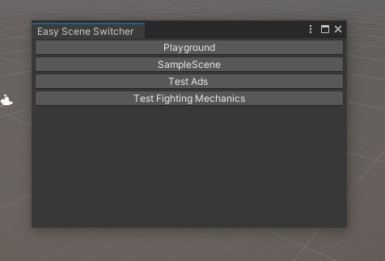
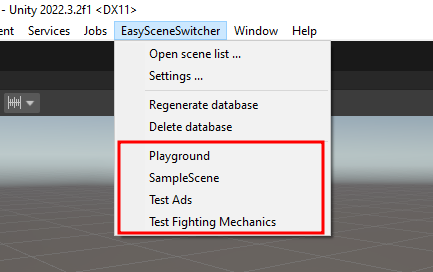
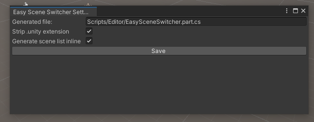

# About
This is a package for Unity that allows you to easily switch scenes from a menu or a separate scene list window  

# Usage
## Scene List Window
Under menu "EasySceneSwitcher" you can open a scene list window (EasySceneSwitcher -> Open scene list ...)  
A scene list window with open up where you can choose needed scene  
  
Clicking on the scene name will open it in the editor with a proper dirty scene check first  

## Inline scene list
By default this package will generate a scene list right in the menu bar under "EasySceneSwitcher" menu  
  
To create this list a special script should be generated first with "EasySceneSwitcher -> Regenerate database" option. By default it will use path "Assets/Scripts/Editor/EasySceneSwitcher.part.cs". This option can be changed in settings.

## Settings
Settings window can be opened by "EasySceneSwitcher -> Settings ..." option. It contains a configurable option for the generated file (Note: The path must be relative to the Assets folder, e.g. "Scripts/Editor/EasySceneSwitcher.part.cs")  
  
Strip .unity extension is enabled by default and just stripping ".unity" suffix from scene names in both inline and window scene lists.  
Generate scene list inline is enabled by default and will generate a scene list in the menu bar. In general, it just controls if the partial class file ("database") is generated or not. Deleting this file will remove inline list but on the next regeneration it will be created again. Disable this option if you don't want this file to be generated next time.  


# Installation
## Unity Package Manager
To install this package use UPM from "Window -> Package Manager" menu.  
Click on the "+" button in the top left corner and select "Add package from git URL..." and paste:  
```
git@github.com:xahon/Easy-Scene-Switcher-For-Unity.git
```

## Manual
Download this repository and drop it into your project. All files are guarded with `#if UNITY_EDITOR` so they will not be included in the build.  

# Contribution
Feel free to contribute to this project.
